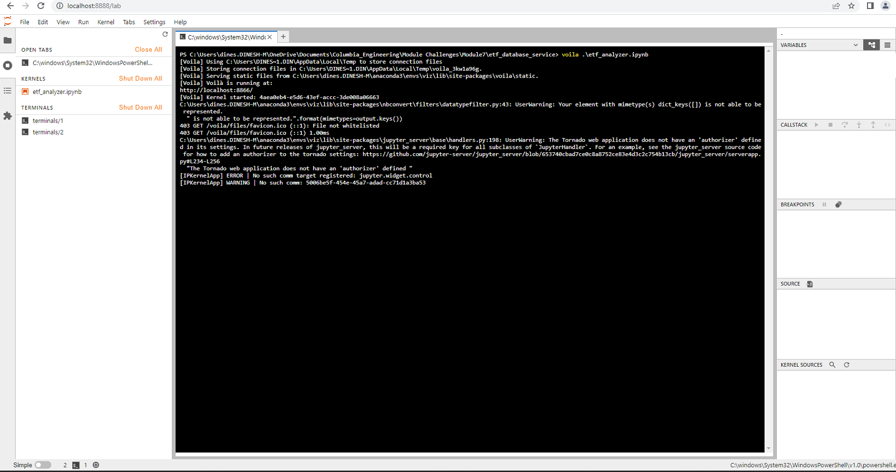

# ETF Analyzer

In recent years, finance has had an explosion in passive investing. Passive investing means that you invest in a basket of assets that’s called an exchange-traded fund (ETF). This way, you don’t spend time researching individual stocks or companies or take the risk of investing in a single stock. ETFs offer more diversification.

The ETF Analyzer is a database application showing how any asset in the ETF portfolio can be analyzed using the cumulative return and the annualized average returns. In the Fintech world, it is quite a common use case to analyze the asset performance in the ETF portfolio.

The ETF Analyzer largely does the following tasks in the etf.db, a sample database.

- Show analysis of the ETF data that a SQL database stores in SQLite
- Plot professionally styled and formatted interactive visualizations

If you look inside 'Images\\..' folder, two screenshots are attached to show how a lightweight web page can be rendered by deploying the Jupyter Notebook via the Voilà library.

---

## Technologies

This project leverages python 3.7.* with the following additional packages:
* [Jupyter Notebook](https://jupyter.org/) - The main module of the Financial Planner is written in Jupyter Notebook.
* [Conda](https://docs.conda.io/projects/conda/en/latest/) - Conda environment is recommended to have Pandas library and other dependencies pre-installed.

**Required Libraries:**

You may need the following libraries to work with the program.

- [Pandas](https://pandas.pydata.org/docs/reference/index.html) - pandas is a Python package providing fast, flexible, and expressive data structures designed to make working with “relational” or “labeled” data both easy and intuitive.
- [hvPlot](https://hvplot.holoviz.org/) - hvPlot provides a high-level plotting API built on HoloViews that provides a general and consistent API for plotting data in Python.
- [SQLAlchemy](https://www.sqlalchemy.org/) - SQLAlchemy is the Python SQL toolkit and Object Relational Mapper that gives application developers the full power and flexibility of SQL.
---

## Usage

To use the ETF Analyzer application, clone the repository and run the **etf_analyzer.ipynb** with Jupyter notebook.

From the Git Bash terminal, make sure to 'activate conda' and appropriate virtual enivorment. Next, launch the JupyterLab web-based interactive development environment (IDE) interface by typing at the prompt:

```python
  > jupyter lab
```

Then, browse to **etf_analyzer.ipynb** starter code file to run the program. See the image below for a quick hint.


Similarly, the Jupyter Notebook output can also be rendered as a web page by deploying the Jupyter Notebook file **etf_analyzer.ipynb** as a web application.

From the Terminal (git bash or python based), type the following command to launch the web page:

```python
  > voila .\etf_analyzer.ipynb
```



**Voila web page view.**

You may see the Jupyter Notebook output as a plain HTML without Code Cells or Markdown attributes.


## Contributors

FinTech Labs, Inc.

---

## License

None